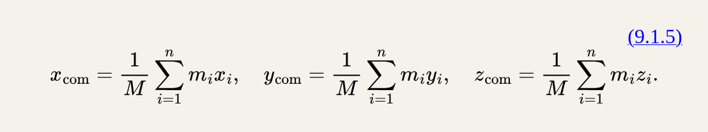

# phy2048

# +description: physics 1 ~!@

## chapter 1 : prelude

### measurements

300 has 3 sig figs apparently

a numerical value for a physical quantity w/out units is meaningless...............................................

physics 1 likes seconds, meters, and kilograms :D

units of other quantities r derived from the base 7 quantities (including kelvin, ampere (electric current), mole, and candela (luminous intensity))

### relevant math

- harmonic mean
  when you have an average with a rate that has a _denominator_ that changes, you can use the harmonic mean, rather than a normal equation
  this might look like:
  H = n / (1/x1 + 1/x2 + 1/x3... 1/xn)
  w series ~!

## chapter 2 : [[id:cf759e59-4cbc-429b-8235-bab7c7e15952][motion along a straight line]] erm how do i link in markdown

## chapter 3 : literally nothing

## chapter 4 : motion in two and three dimensions

in 2D w/ constant acceleration , we use several important formulas

the displacement curve equation
x-x*{0} = v*{0}t + 1/2 at^{2}

the definition of acceleration
v = v\_{0}+at

we also use vectors since we're dealing w more dimensions :3

### position and displacement

the location of a particle relative to the origin in a provided coordinate system is given by a position vector _r_

- which has the usual xi+yj+zk with xyz being scalar components

a position vector is described either by

- a magnitude & one or two angles for orientation
- or by its vector/scalar components
  a position vector is the vector sum of its vector components :)

THE MAGNITUDE IS A HYPOTENUSE TO A RIGHT TRIANGLE W/ X AND Y BEING THE COMPONENTS WHY I SO DUMB
also angles r important and help find stuff :3

displacement between vectors can be written as

- Δr^{->} = r*{2}-r*{1}
- Δr^{->} = Δxi + Δyj + Δzk

  _lecture notes_

### average velocity and instantaneous velocity

if a particle moves from one point to another, we might need to know how fast it moves

- we can consider quantities such as average velocity and instaneous velocity using vectors and vector notation

- if a particle undergoes a displacement Δr^{->} in time interval Δt , its average velocity v\_{avg}^{->} for that time interval is
  - Δr^{->} / Δt .
    _this tells us that the direction of the_ v\_{avg}^{->} _must be the same as that of the displacement vector (being_ r^{->} _)_

- as Δt is shrunk to 0, v\_{avg}^{->} reaches a limit called the velocity/instantaneous velocity v^{->} which is = dr^{->}/dt , this is the calculus aspect of the motion...........
  - this can be rewritten in unit-vector notation as
    - v^{->} = v*{x}i + v*{y}j + v*{z}k
      where v*{x} = dx/dt , v*{y} = dy/dt , and v*{z} = dz/dt
    - the direction of the instantaneous velocity v^{->} is always along the TANGENT to the particle's path at the particle's position

\*\* average acceleration and instantaneous acceleration

- basically everything from 4.2 can be applied but for velocity to acceleration
  ill lyk if anything else is important doe

### projectile motion \*important

_key ideas_

- in projectile motion, the horizontal motion and the vertical motion are independent of each other, with neither affecting the other

let's consider a special case of 2D motion:

- a particle moves in a vertical plane with some initial velocity v\_{0}^{->} but its acceleration is always the free-fall acceleration g^{->} which is downward
  - such a particle is called a _projectile_ (meaning that it's launched) and this motion is called _projectile motion_

let's analyze this!

- when a path followed by a projectile is not impacted by air , the projectile is launched with an initial velocity equal to
  v*{0}^{->} = v*{0x}i + v*{0y}j .
  this motion is a combo of vertical motion (constant acceleration) and horizontal motion (constant velocity), as shown by the velocity components
  ?*{/(??? i think x and y r considered horizontal, with z being impacted by g ??????/ )}

- the components v*{0x} and v*{0y} can be discovered if we know the angle θ*{0} between v*{0}^{->} and the positive x direction :
  - v*{0x} = v*{0}cosθ*{0} and v*{0y} = v*{0}sinθ*{0}

during its 2D motion, the projectile's position vector and velocity vector change continuously, but its acceleration vector is constant and is _always_ directed vertically downward. the projectile has _no_ horizontal acceleration

knowing this, we can break up a problem involving 2D motion into two separate 1D problems - one for horizontal motion (w/ zero acceleration) - and one for vertical motion (w/ constant downward acceleration)

#### the horizontal motion

because there is _no acceleration_ , the horizontal component v*{x} remains unchanged from its initial value v*{0x}

at any time _t_ we can use the projectile's horizontal displacement to write :

- x - x*{0} = v*{0x}t

using the value from before, we can further write this as

- x - x*{0} = (v*{0}cosθ\_{0})t

#### the vertical motion

- the eq uation of the path
- the horizontal range
- the effects of the air

### uniform circular motion

angular velocity (rad/s = s^{-1}):ω = const
θ = ωt

one full turn is 2π = ω x T
or period (s): T = 2π / ω

frequency of revolutions (1/s = Hz): f = 1/T so inverse ^
T also = 2πr/v where so v = ωr
circumference/T = v aka speed
v tangent to r^{}^{\rightarrow} ????????????

how strong? need magnitude equation = change in velocity/change in time at any given moment

- the derivative ig

ig for acceleration direction is centripetal (magnitude still constant)
a = v^{2}/r
idk we'll come back

in uniform circular motion, the magnitude of the position vector wrt the center of the origin does _not_ change

- the same can be said about the magnitude of the velocity vector

the acceleration vector points towards the center of the circle whereas the velocity vector is tangent to the circular path

direction is always changing and only acceleration is constant

centripetal force :
LMAO FICTICIOUS AHH FORCE
\*\* relative motion
uh something ab coordinate systems

apparently galilean relativity tells us that acceleration is invariant between inertial reference frames - which means that acceleration stays the same in all frames moving at constant velocity relative to each other

- velocity changes by adding/subtracting the constant relative velocity so acceleration does not change (derivative of constant is 0)

## chapter 5 : uh isaac newton #dynamics

### laws

all laws of physics are valid in an infinite number of _inertial_ rest frames

- check via newton's first law

- law 1 : no force -> cannot change velocity -> does not accelerate

- if F\_{net} = 0 , v is constant and vice versa

  _INERTIA_ is a tendency for a body to continue its state of motion (mass is a measure of inertia.......)

- law 2 : F = ma

- F is measured in kg m / s^{2} = newton = N
- VECTOR EQUATION!!!
- F is the NET Force
- \*assuming body acts as one piece
- acceleration due to a force is immediate
- the mass is constant (otherwise we couldn't use F=ma)(for rn)
- no exceptions ??......?....?

- law 3 : for every action, there's an equal but opposite reaction

- normal or perpendicular force F\_{N}^{\rightarrow}
  - changes its magnitude to adjust to the opposite force :0
    "things can move because there's more going on than just the action and reaction forces"

### forces

objects don't have force -> forces act on objects

OMG FREEBODY DIAGRAMS YAY

_forces of nature_ ?

- gravitational
  -> F\_{g}= mg -> "weight" (the force of gravity)
  - no acceleration/no movement means F\_{net}^{\rightarrow} = 0 which means normal or tension force and gravitational force r equal
- electric & magnetic -> electromagnetic

_conveniences_

- tension - always assume that ropes have no mass and r unbreakable
- contact
  ->friction (parallel)
  -> normal (at right angle)
- spring
- drag
  all of the above are electromagnetic in origin

_centripetal_ force -> not a type of force ; simply a direction

when all of the forces on an object are balanced, said object can still move but it won't be acceleration, therefore the velocity will not change

he hates 45°

#### friction

two kinds :

- kinetic friction - resistive force against sliding materials
  - equation: f*{k}= μ*{k} (F\_{N})

  - will often generate heat and/or sound
    - movement against two weird surfaces rubbing against eachother might be able to form weak intermolecular bonds
    - bonds break and newly-freed molecules spring back, producing heat and sound
  - rougher materials have more surfaces to catch onto eachother
    - coefficient of kinetic friction : μ\_{k}

how hard the materials are pressed together also puts more surfaces in contact w/eachother

- F\_{N} -> surfaces push right back against each other

- static friction - also a resistive force
  - equation: f*{s , max} = μ*{s} (F\_{N})

- tech not an equation?????????????????????? tells us what force of static CANT be
  - both direction and strength can change
  - NOT related to newton's third law but is kinda reactive to how an object affects another object
  - there's a maximum amount f\_{s, max} that can be overcome
  - coefficient of static friction that measures the roughness between any two objects : μ\_{s}

    coefficients r NOT vector relationships, r unitless, and r typically less than 1

    coefficient of static friction is greater than kinetic friction

## chapter 7 and chapter 8 : energy is important

### systems

in order to closely study how motions #works and what types of forces and energy is involved, we gotta recognize that we're dealing w different types of systems

a _non-conservative system_ is one that loses energy through motion , via heat or sound (lowkenuinely more realistic i thinks)
a _conservative system_ has no loss of energy

- although this doesn't mean its constantly the same type of energy, it js has to be balanced
- KE(1) + PE(1) = KE(2) + PE(2) and so on

furthermore,
a force is a _conservative force_ if
;the net work it does on a particle moving around a closed path is 0
;the net work it does on a particle going from one point to another does not depend on the path taken

- the gravitational force and the spring force discussed below are examples of conservative forces
  and remember, the kinetic frictional force is a non-conservative force...

### i got work to dooooooo

WORK is basically the amount of force being used over a certain distance moved right - product of force and displacement  
 ts is why we integrate force to get the amount of work : forces aren't necessarily constant over a specific distance so integrals come handy

in some general circumstances, we use cos(theta) cuz that's more relevant
_W= Fcos(theta) _ d*
or in some cases just *W=F-> _ d->_ (dot product of two vectors) where only the component of F-> that is along the displacement can do work
when two or more forces act on an object, their _net work_ is the sum of the individual works done by each force
which is also equal to the work that would be done on the object by the _net force_ of those forces

for a particle, a change _delta K_ in the kinetic energy is equal to the net work done on the particle
_delta K = Kfinal - Kinitial = W_ we also get that _Kfinal = Kinital + W_

- regarding mechanical physics
- i think that work is also positive when its _in the direction of the motion_
- work is also negative when its _in the opposite direction of the motion_
- when the force is _normal_ to the system, the work is _zero_
- work is positive when the work is being done and energy is being transferred _to_ the _system_
- work is negative when the work is being _From_ the system  
  energy can be seen as the ability to do work ; energy is a scalar quantity and is associated w/ the state/condition of several objects
  let's look at some different kinds of energy !

### kinetic energy

since we need work to get stuff moving, we gotta figure out what it takes to get stuff of mass (m) to move at a specific speed (v)

thus,
kinetic energy (K) is associated with the motion of a particle of mass m and speed v (w/ v being less than the speed of light) w/ the following equation:
so _KE = 1/2 mv^2_

### potential energy (\*important)

basically synonymous w/ potential work and known as _U_
potential energy is energy associated w/ the configuration of a system in which a conservative force will act
thus, when work does occur, potential energy decreases... the change in potential energy, being _delta U_ is equal to negative work

we have:

#### general/potential gravitational energy

_PEgrav = mgh_

_in general_ the work done by a gravitational force on a particle-like object of mass as it moves through displacement d -> is
_Wg = mgdcos(theta)_ in which theta is the angle between Fg -> and d->

now we add this general one to our kinetic energy equation : _Wa + Wg = delta K_ (Wa is work done by applied force)
if there is no change in kinetic energy, we get _Wa = -Wg_

#### spring general/elastic potential energy

the relaxed state of a spring is when it is neither compressed or extended - often there is a fixed end and a free end anyways

if we pull on a spring, the spring pulls back and thus the harder u push a spring -> the harder the spring resists type jawn
ts is becuz its trying to restore, or go back to, its relaxed state so ya _restoring force_

anyways, ts force can be deduced from _Fs -> = -kd->_ to a simpler _Fs = -kx_ where x has an origin =0
; note that ts is a variable force (reliant on x) and also a linear relationship

k is a constant called the _spring constant_ or _force constant_ which measures the _stiffness_ of the spring
; a larger k, the more stiff the spring is ; the larger the k , the stronger the spring's pull/push will be for a given displacement
k is measured in N/m

REGARDING THE WORK

- assumptions
- first let's assume that the spring is meaningless
- secondly let's assume its an ideal spring, perfect to hooke's law
- frictionless, particle-like

our Ws can be found through ts equation : _Ws = -1/2kx^2_ , being negative because it is being pushed away
we can use _PEspring = 1/2kx^2_ , being positive because it is losing energy

as before, delta K can = Wa + Ws where Wa = -Ws w/ no change in kinetic energy (if the block is stationary at the beginning and end)

explanation :

###### hooke's law

who tf is hooke welllll

the first two equations above were derived from Hooke's Law. the negative sign indicates that the direction of the spring force is always opposite to the direction of the displacement of the spring's free end.

### power :)

power is used to measure how much energy is converted throughout time

we use ts equation: _watts (power) = J (of energy) / s (the time)_
instantaneous power is the derivative - P = dW/dt

being the net force applied to something w/ a particular average velocity, we also have the equation :
_Paverage = F_ Vaverage\*
P = Fvcos(theta) = F->v-> where v is instantaneous velocity

hois

## chapter 9 i think

ok now i get to use my notes!

### center of mass

in the real world, mass may be distributed unevenly among an object. ts is important because the mass actually has a big role in how the object moves.
usually mass pulls toward the center, heavier parts of an object.

the _center of mass_ of an object is lowk guaranteed to follow a parabolic path, with the other parts of the object following it.

text book def : the center of mass of a system of particles _is the point that moves as through all of the system's mass were concentrated there_ and _as if all external forces were applied there_.

if we have many particles strung out among a system we can find the location of the center of mass per axis

xcom = 1/M sigma mixi and so forth

make vector i guess

crash course physics says something along the lines of
( $\Sigma$ each mass \* distance from center ) / total mass

### system of particles - newton's second law

### linear momentum

momentum is an object's tendency to remain in motion - how hard is it to stop?
momentum can be calculated by _mass_ velocity\* and is defined as a vector quantity P->

we can write _F-> net = dp-> /dt_

the time roc of the momentum of a particle is equal to the net force acting on the particle and is in the direction of that force - giving us the equation above
thus, if there is no net external force, _P-> cannot change_

- if no net external force is acting -> momentum is conserved

- if a system is closed and isolated -> momentum is constant
  delta P is = 0 so P is constant

if we have a [system of particles] where each particle has its own mass, velocity, and linear momentum, we need a figure out a way to measure the system as a whole
this totel linear momentum, P->, can be defined as the vector sum of the individual particles' linear momenta
we end up with _P->=Mv->com_

### impulse

usually noted with a j - impulse is the integral of net force over time -> this measures the change in momentum

### collisions

all collisions conserve momentum!
we got _elastic_ collisions which r a bit unrealistic
these r collisions in which kinetic energy is neither created or destroyed - all energy transfers

_inelastic_ collisions r more realistic - energy is lost to heat + sound

_perfectly inelastic_ collisions involve those in which objects stick together after colliding, moving together and so on.

### momentum and kinetic energy in collisions

### idk if there's more stuff
